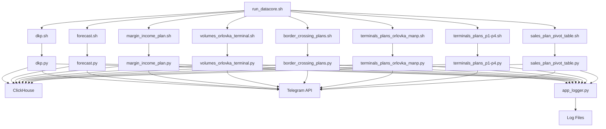

# DataCore

**DataCore** — система автоматизированной обработки и анализа данных для различных типов планов и прогнозов. Проект включает в себя модули для обработки планов доходности (DKP), прогнозирования, анализа маржинального дохода, планов терминалов и других бизнес-показателей.

## 📋 Оглавление

- [Описание проекта](#описание-проекта)
- [Блоки работ](#блоки-работ)
- [Архитектура](#архитектура)
- [Технологический стек](#технологический-стек)
- [Требования](#требования)
- [Установка и настройка](#установка-и-настройка)
- [Сборка и запуск](#сборка-и-запуск)
- [Конфигурация](#конфигурация)
- [Структура проекта](#структура-проекта)
- [Тестирование](#тестирование)
- [Мониторинг и логирование](#мониторинг-и-логирование)
- [Разработка](#разработка)

## 🎯 Описание проекта

DataCore представляет собой автоматизированную систему для:
- Обработки документов планирования и контроля (DKP)
- Генерации прогнозов по различным показателям
- Анализа планов маржинального дохода
- Обработки данных по терминалам Орловка, P1-P4
- Создания сводных таблиц планов продаж
- Анализа планов пересечения границ
- Мониторинга объемов терминалов

Система работает в непрерывном режиме, периодически обрабатывая данные и отправляя уведомления о результатах через Telegram.

## 🔧 Блоки работ

### 1. **DKP (Документы планирования и контроля)**
- **Файл**: `scripts/dkp.py`
- **Функционал**: Основной модуль для обработки документов планирования
- **Особенности**: 
  - Парсинг Excel файлов со сложной структурой
  - Группировка данных по блокам и колонкам
  - Валидация и очистка данных
  - Интеграция с ClickHouse

### 2. **Прогнозирование**
- **Файл**: `scripts/forecast.py`
- **Функционал**: Генерация прогнозов по историческим данным
- **Применение**: Планирование будущих показателей

### 3. **Анализ маржинального дохода**
- **Файл**: `scripts/margin_income_plan.py`
- **Функционал**: Расчет и анализ планов маржинального дохода
- **Особенности**: Обработка финансовых показателей

### 4. **Планы терминалов**
- **Файлы**: 
  - `scripts/terminals_plans_orlovka_manp.py` (Орловка)
  - `scripts/terminals_plans_p1-p4.py` (Терминалы P1-P4)
  - `scripts/volumes_orlovka_terminal.py` (Объемы Орловка)
- **Функционал**: Обработка планов различных терминалов
- **Особенности**: Специализированная логика для каждого типа терминала

### 5. **Планы пересечения границ**
- **Файл**: `scripts/border_crossing_plans.py`
- **Функционал**: Анализ планов пересечения границ
- **Применение**: Логистическое планирование

### 6. **Сводные таблицы продаж**
- **Файл**: `scripts/sales_plan_pivot_table.py`
- **Функционал**: Создание сводных таблиц планов продаж
- **Особенности**: Агрегация данных по различным срезам

## 🏗️ Архитектура



## 🛠️ Технологический стек

- **Язык программирования**: Python 3.8
- **Основные библиотеки**:
  - `pandas` 1.4.3 - обработка данных
  - `numpy` 1.24.2 - численные вычисления
  - `openpyxl` 3.1.2 - работа с Excel файлами
  - `clickhouse-connect` 0.5.14 - подключение к ClickHouse
  - `python-dotenv` 1.0.0 - управление переменными окружения
  - `requests` 2.31.0 - HTTP запросы
  - `notifiers` 1.3.3 - уведомления
- **База данных**: ClickHouse
- **Контейнеризация**: Docker
- **Мессенджер**: Telegram API
- **Тестирование**: pytest 8.3.4

## 📋 Требования

### Системные требования
- Python 3.8+
- Docker (опционально)
- Linux/Unix окружение для выполнения bash скриптов

### Переменные окружения
Создайте файл `.env` в корне проекта со следующими переменными:

```bash
# Путь к корневой директории DataCore
XL_IDP_ROOT_DATACORE=/path/to/datacore

# Путь для Docker (при использовании контейнера)
XL_IDP_PATH_DOCKER=/app

# Telegram Bot настройки
TOKEN_TELEGRAM=your_telegram_bot_token
CHAT_ID=your_chat_id
TOPIC=your_topic_id
ID=your_message_id

# ClickHouse настройки (добавьте по необходимости)
CLICKHOUSE_HOST=localhost
CLICKHOUSE_PORT=9000
CLICKHOUSE_USER=default
CLICKHOUSE_PASSWORD=
```

## 🚀 Установка и настройка

### 1. Клонирование репозитория
```bash
git clone <repository-url>
cd DataCore
```

### 2. Создание виртуального окружения
```bash
python3 -m venv venv
source venv/bin/activate  # Linux/macOS
# или
venv\Scripts\activate     # Windows
```

### 3. Установка зависимостей
```bash
pip install -r requirements.txt
```

### 4. Настройка переменных окружения
```bash
cp .env.example .env  # если есть пример
# Отредактируйте .env файл с вашими настройками
```

### 5. Настройка прав доступа для bash скриптов
```bash
chmod +x bash/*.sh
```

## 🏃 Сборка и запуск

### Локальный запуск

#### Разовый запуск отдельного модуля:
```bash
# Установка переменной окружения
export XL_IDP_ROOT_DATACORE=$(pwd)

# Запуск конкретного скрипта
python scripts/dkp.py
python scripts/forecast.py
python scripts/margin_income_plan.py
```

#### Запуск через bash скрипты:
```bash
# Установка переменной окружения
export XL_IDP_ROOT_DATACORE=$(pwd)

# Запуск отдельного модуля
./bash/dkp.sh
./bash/forecast.sh

# Запуск всей системы в непрерывном режиме
./bash/run_datacore.sh
```

### Запуск через Docker

#### 1. Сборка Docker образа
```bash
docker build -t datacore:latest \
  --build-arg XL_IDP_PATH_DOCKER=/app .
```

#### 2. Запуск контейнера
```bash
docker run -d \
  --name datacore \
  -v $(pwd):/app \
  -v $(pwd)/data:/app/data \
  -v $(pwd)/logging:/app/logging \
  --env-file .env \
  datacore:latest
```

#### 3. Просмотр логов контейнера
```bash
docker logs -f datacore
```

### Docker Compose (рекомендуется)

Создайте файл `docker-compose.yml`:

```yaml
version: "3.9"
services:
    datacore:
        container_name: datacore
        restart: always
        ports:
          - "8016:8016"
        volumes:
          - ${XL_IDP_PATH_DATACORE_SCRIPTS}:${XL_IDP_PATH_DOCKER}
          - ${XL_IDP_ROOT_DATACORE}:${XL_IDP_PATH_DATACORE}
        environment:
          XL_IDP_ROOT_DATACORE: ${XL_IDP_PATH_DOCKER}
          XL_IDP_PATH_DATACORE: ${XL_IDP_PATH_DATACORE}
          TOKEN_TELEGRAM: ${TOKEN_TELEGRAM}
        build:
          context: DataCore
          dockerfile: ./Dockerfile
          args:
            XL_IDP_PATH_DOCKER: ${XL_IDP_PATH_DOCKER}
        command:
          bash -c "sh ${XL_IDP_PATH_DOCKER}/bash/run_datacore.sh"
        networks:
          - postgres
```

Запуск через Docker Compose:
```bash
docker-compose up -d
```

## ⚙️ Конфигурация

### Основные настройки
Конфигурация осуществляется через файл `scripts/settings_dkp.py`:

- `NOT_COUNT_BLOCK` - блоки, исключаемые из подсчета
- `FILTER_SUFFIXES` - суффиксы для фильтрации колонок
- `DATE_FORMATS` - поддерживаемые форматы дат
- `MONTH_NAMES` - названия месяцев на русском языке

### Логирование
Логи сохраняются в директории `scripts/logging/` с именами файлов, соответствующими модулям.

### Уведомления
Настройка Telegram уведомлений через переменные окружения в `.env` файле.

## 📁 Структура проекта

```
DataCore/
├── bash/                           # Bash скрипты для запуска
│   ├── run_datacore.sh            # Основной скрипт непрерывного запуска
│   ├── dkp.sh                     # Запуск модуля DKP
│   ├── forecast.sh                # Запуск модуля прогнозирования
│   ├── margin_income_plan.sh      # Запуск анализа маржинального дохода
│   ├── terminals_plans_*.sh       # Запуск планов терминалов
│   ├── border_crossing_plans.sh   # Запуск планов пересечения границ
│   ├── sales_plan_pivot_table.sh  # Запуск сводных таблиц продаж
│   └── volumes_orlovka_terminal.sh # Запуск анализа объемов
├── scripts/                       # Python модули
│   ├── __init__.py               # Инициализация пакета
│   ├── app_logger.py             # Система логирования
│   ├── settings_dkp.py           # Настройки и конфигурация
│   ├── dkp.py                    # Основной модуль DKP
│   ├── forecast.py               # Модуль прогнозирования
│   ├── margin_income_plan.py     # Анализ маржинального дохода
│   ├── terminals_plans_*.py      # Модули планов терминалов
│   ├── border_crossing_plans.py  # Планы пересечения границ
│   ├── sales_plan_pivot_table.py # Сводные таблицы продаж
│   ├── volumes_orlovka_terminal.py # Анализ объемов терминалов
│   └── logging/                  # Директория логов
├── tests/                        # Тесты
│   └── test_dkp.py              # Тесты модуля DKP
├── diagrams/                     # Диаграммы архитектуры
│   ├── dkp_class_diagram.png    # UML диаграмма классов
│   ├── dkp_sequence_diagram.png # UML диаграмма последовательности
│   └── dkp.puml                 # PlantUML исходник
├── Dockerfile                    # Конфигурация Docker
├── requirements.txt              # Python зависимости
└── README.md                     # Документация проекта
```

## 🧪 Тестирование

### Запуск тестов
```bash
# Активация виртуального окружения
source venv/bin/activate

# Запуск всех тестов
pytest

# Запуск тестов с покрытием
pytest --cov=scripts

# Запуск конкретного теста
pytest tests/test_dkp.py

# Запуск тестов в verbose режиме
pytest -v
```

### Создание новых тестов
Тесты должны располагаться в директории `tests/` и именоваться по шаблону `test_*.py`.

## 📊 Мониторинг и логирование

### Логирование
- **Уровень логирования**: INFO и выше
- **Местоположение**: `scripts/logging/`
- **Формат**: `[timestamp] LEVEL [module.function:line] message`
- **Ротация**: автоматически по файлам для каждого модуля

### Мониторинг
- **Telegram уведомления**: автоматическая отправка результатов обработки
- **Статус выполнения**: логирование успешных и неуспешных операций
- **Метрики производительности**: время выполнения каждого модуля

### Пример просмотра логов
```bash
# Просмотр логов конкретного модуля
tail -f scripts/logging/dkp.log

# Просмотр всех логов
tail -f scripts/logging/*.log

# Поиск ошибок во всех логах
grep -r "ERROR" scripts/logging/
```

## 👨‍💻 Разработка

### Структура модуля
Каждый новый модуль должен следовать общей структуре:

```python
import os
from scripts.app_logger import get_logger
from scripts.settings_dkp import *

# Инициализация логгера
logger = get_logger(os.path.basename(__file__).replace(".py", ""))

class YourModule:
    def __init__(self):
        # Инициализация
        pass
    
    def process(self):
        try:
            # Основная логика
            logger.info("Начало обработки")
            # ... код ...
            logger.info("Обработка завершена успешно")
        except Exception as e:
            logger.error(f"Ошибка при обработке: {e}")
            raise

if __name__ == "__main__":
    module = YourModule()
    module.process()
```

### Соглашения по коду
- **Именование**: snake_case для функций и переменных, PascalCase для классов
- **Документация**: docstrings для всех публичных методов
- **Типизация**: использование type hints где возможно
- **Обработка ошибок**: обязательное логирование и правильная обработка исключений

### Добавление нового модуля

1. **Создайте Python файл** в директории `scripts/`
2. **Создайте bash скрипт** в директории `bash/`
3. **Добавьте вызов** в `bash/run_datacore.sh`
4. **Создайте тесты** в директории `tests/`
5. **Обновите документацию**